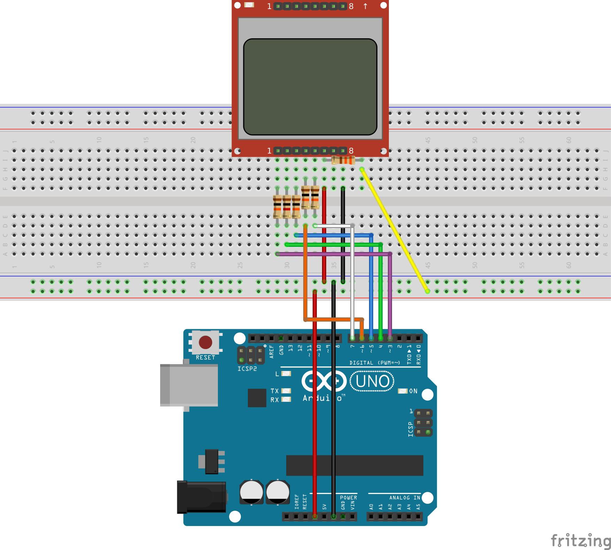

# PCD855 usage example with an Arduino Uno

This is a simple example of how to use the PCD855 LCD controller with an Arduino Uno. \
The code initializes the display using `PCD8544Gpio` struct using pins 3 to 7.
It then shows the Rust logo using `demo` module.

## Requirements

### Hardware
- An Arduino Uno board or compatible
- A PC8544-based display, most commonly found in small Nokia 5110's 
- A breadboard (optional)
- Some Dupont wires, and resistors (see below)

### Software
You'll need to follow the instructions in [avr-hal](https://github.com/Rahix/avr-hal#quickstart)
to be able to build the example out of the box.

## Wiring

| PIN NAME  | ARDUINO PIN  | RESISTOR VALUE |
|-----------|------------- |----------------|
| RST       | 3            | 10kΩ           |
| CE        | 4            | 1kΩ            |
| DC        | 5            | 10kΩ           |
| DIN       | 6            | 10kΩ           |
| CLK       | 7            | 10kΩ           |
| VCC       | 3V3          | ∅              |
| BL        | 3V3          | 330Ω           |
| GND       | GND          | ∅              |

## Using another AVR-based board

Using an alternative board is simple. You'll need to modify the values in .cargo/config.toml, Ravedude.toml accordingly.

